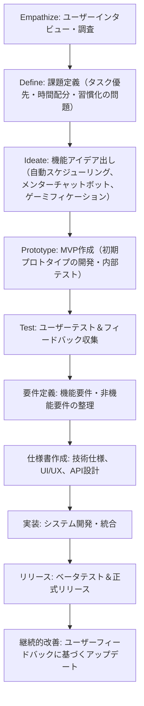

# AIアクションプランナー・ハビットコーチ - 設計ドキュメント

## 1. Stanford D-School様式に基づくプロセス

### 【Empathize（共感）】
- **目的**: ターゲットユーザー（学生、フリーランス、副業希望者）の現状を深く理解する。
- **活動例**:
  - インタビューやアンケート実施：ユーザーが直面する課題（タスクの優先順位が分からない、時間配分の見積もりが難しい、習慣化ができない）をヒアリング。
  - ユーザーストーリーの作成：実際の利用シーンや障壁を具体的に記述。

### 【Define（問題定義）】
- **目的**: ユーザーの抱える課題を明確にする。
- **例**:  
  「目標達成後に設定したタスクが曖昧で、実行に移す際の優先順位や時間配分の見積もりが不十分なため、行動に移すのに時間がかかり、習慣化が進まない。」
- **成果物**: 問題定義書、ユーザーのペルソナおよびニーズ分析。

### 【Ideate（アイデア創出）】
- **目的**: 問題を解決するための革新的な機能をブレインストーミングする。
- **活動例**:
  - AIによるタスク解析・自動スケジューリング機能のアイデア出し。
  - LLMベースのインタラクティブメンターチャットボットの検討。
  - ゲーミフィケーション（ポイント、バッジ、チャレンジ機能）による習慣形成の促進。
- **成果物**: アイデア一覧、機能コンセプトの概要。

### 【Prototype（プロトタイピング）】
- **目的**: アイデアを具体的な形にするための試作品（MVP）を作成する。
- **活動例**:
  - マンダラチャートと連動するタスク優先順位・時間配分提案モジュールのプロトタイプ作成。
  - チャットボットの初期バージョンの構築（シンプルな対話形式でアドバイス提供）。
  - ゲーミフィケーションの基本フレームワーク（ポイントシステム、チャレンジ機能）の試作。
- **成果物**: 初期プロトタイプ、ユーザーフィードバックを受けた改善案。

### 【Test（テスト）】
- **目的**: プロトタイプを実際のユーザーに試してもらい、フィードバックを収集する。
- **活動例**:
  - ベータテストの実施：ユーザーが実際に使用してみた感想や問題点をヒアリング。
  - ユーザー行動の解析：実際のタスク実行率、使用頻度、離脱ポイントのデータ収集。
- **成果物**: テスト結果レポート、改善項目リスト。

## 2. 要件定義および仕様書

### 【機能概要】
「AIアクションプランナー・ハビットコーチ」は、ユーザーが作成した曼荼羅チャートを基に、タスクの優先順位付け、最適な時間配分、実行のリマインダー、インタラクティブなメンター機能、そしてゲーミフィケーション要素を提供する統合プラットフォームです。

### 【機能要件】
1. **タスク解析・自動スケジューリング**
   - ユーザーの曼荼羅チャートから各タスクを解析し、優先順位と実行順序を自動生成。
   - 各タスクの所要時間や期日を推定し、スケジュールを提案。

2. **タイムトラッキング＆リマインダー**
   - タスク開始・終了時間を記録し、進捗をモニタリング。
   - タスク実行前にプッシュ通知やメールでリマインダーを送信。

3. **LLMベースのメンターチャットボット**
   - ユーザーの質問や不安に対して、実績データやベストプラクティスに基づいたアドバイスを提供。
   - 定期的な進捗確認・フィードバックを行う対話型機能。

4. **ゲーミフィケーション機能**
   - タスク達成ごとにポイント、バッジ、レベルアップを実装。
   - 日々・週単位のチャレンジ機能の提供と、ランキング機能（オプション）。

5. **統合ダッシュボード**
   - ユーザーの全体のタスク進捗、達成状況、報酬状況を一元管理。
   - 視覚的に分かりやすいグラフやチャートで表示。

### 【非機能要件】
- **ユーザビリティ**: 直感的なインターフェースと操作性、モバイルレスポンシブデザイン。
- **パフォーマンス**: リクエストに対するレスポンスは2秒以内。
- **セキュリティ**: ユーザーのデータプライバシー保護、認証とアクセス制御。
- **拡張性**: 将来的な機能追加や他システムとの連携が容易な設計。

### 【技術仕様】
- **フロントエンド**: React.js（または類似のSPAフレームワーク）、HTML5、CSS3など
- **バックエンド**: Node.js、Express.js、Python（AI/LLM部分）など
- **データベース**: MongoDBまたはPostgreSQL
- **LLM連携**: OpenAI API等の利用を検討
- **通知機能**: Firebase Cloud Messagingまたは同等のサービス

### 【UI/UX設計】
- ユーザーが一目で全体の進捗状況やタスクの優先順位が分かるダッシュボード。
- チャットボットとの対話画面はシンプルかつ親しみやすいデザイン。
- ゲーミフィケーション要素は、アニメーションやバッジ表示で視覚的に楽しめる仕組み。

## 3. 最終プロセスのマーメイド記法による図式化

## まとめ

- **デザイン思考のプロセス**に沿って、ユーザーの課題を深掘りし、アイデア創出、プロトタイピング、テストを経て機能改善を図ります。
- **要件定義および仕様書**では、具体的な機能・技術的要件、UI/UXデザイン、セキュリティや拡張性などを詳細に記述します。
- **マーメイド記法の図**により、全体のプロセスフローを視覚的に把握できるようにします。

このWebアプリケーションを完成させ、デプロイし、多くのユーザーに利用してもらうことがゴールです。スタート要素は大谷翔平選手も利用した曼荼羅チャートをユーザーから与えられたメインテーマからAIで作成することです。
